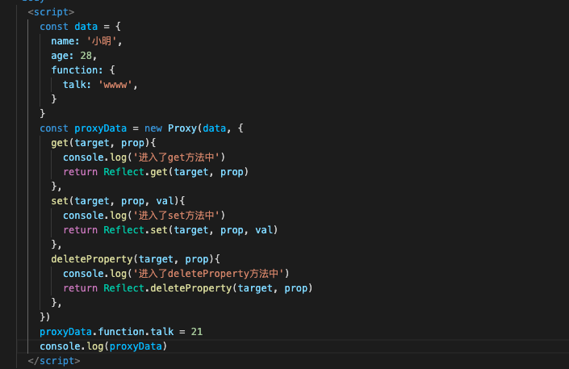

## Vue2和Vue3的差别
+ v2和v3的响应式原理是不一样的。v2中的响应式是通过对象的defineProperty对已有的属性值进行数据劫持（监视和拦截）v3则是通过proxy和reflect对数据进行拦截和处理
+ v2中是通过：Object.defineProperty(data,'name',{ get(){}, set(){} })。他有三个参数，分别是对象，属性和要定义的属性描述对象。当属性name读取的时候，会进入到get中，当属性name的值发生改变则会进入到set中进行修改
+ v3是通过proxy代理对数据进行拦截，然后再通过reflect对相应的属性进行动态操作。

### vue2的缺陷
+ 只能监听到对象的读取和修改，当对象属性发生新增和删除的时候，监听不到
+ 如果目标是数组，他会重写数组更新一系列元素的方法，来达到响应式效果。如果你改变数组长度或者通过下标来改变值，界面不会更新。（set或者$set可以处理这个问题）