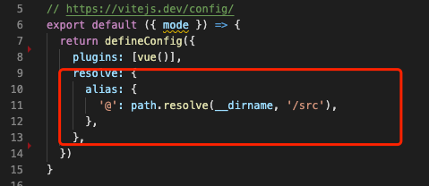
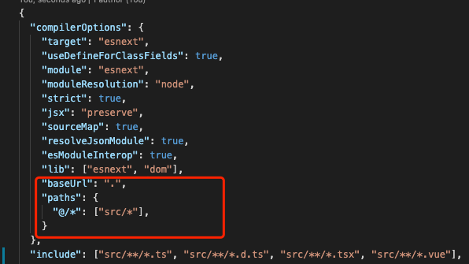
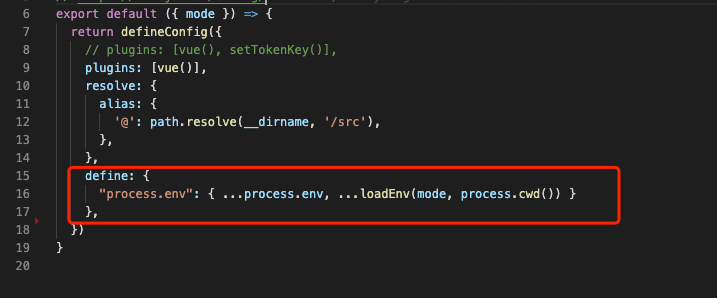

# vite是真的快
用了两三次vite，快，是我对它感觉最明显的一点。项目启动的时候，它将项目主要分为两部分。代码合依赖包。我发现vite每次编译完，会把node_modules里面的包进行一些缓存，但又不是所有的包，所以我觉得这里是项目中引用到的包文件，缓存之后，在你编辑完代码保存之后，他好像不会重新再次读取node_modules里面的内容，而是读取它缓存机制里面的包文件（在node_modules中的.vite）。而你修改完代码，它只需要找到你对应是哪个文件进行修改了，直接更新对应的文件就可以了
## 那些我遇到的问题
### @引发的路径问题
当在之前的项目中习惯使用@符号之后，我以为vite会默认支持@符号。结果发现不行。需要在vite.config.ts中进行相关的配置

### Cannot find module 'xxxx' or its corresponding type declarations.
当我以为我的路径问题配置的没毛病了，却在npm run build出现了另一个路径问题。如标题所示。这时候你需要在tsconfig.json中添加路径相关的配置

### 缓存问题
之前说vite快是因为第一次编译的时候会把一些所需依赖进行缓存，但我在node_modules里面一些包进行调试的时候，发现怎么断点都不行，最后发现浏览器运行的依赖文件中根本没有看到我所调试的代码。后面我发现了，vite会把运行时候的缓存依赖保存到node_modules下的.vite中。如果需要去除依赖我发现两种办法：
+ 手动删除.vite文件夹
+ 通过命令npx vite --force清除缓存
### 环境变量(process.env和import.mate.env)
因为在项目中会用到第三方包的依赖，在第三方包中，有用到node的process访问当前环境变量，导致出错。所以需要在vite.config.ts中配置如下

### Could not find a declaration file for module 'xxxxxx', Try `npm i --save-dev @types/xxx` if it exists or add a new declaration (.d.ts) file containing `declare module 'xxx';`
这个问题不是vite构建工具的错误，他是说你所引入的第三方包没有提供TS的类型说明，当import引入的时候识别不了这个包的类型就报错了。你需要在env.d.ts文件中添加这样一行代码：declare module 'xxx'。[具体可以点击查看](https://zhuanlan.zhihu.com/p/349595729)